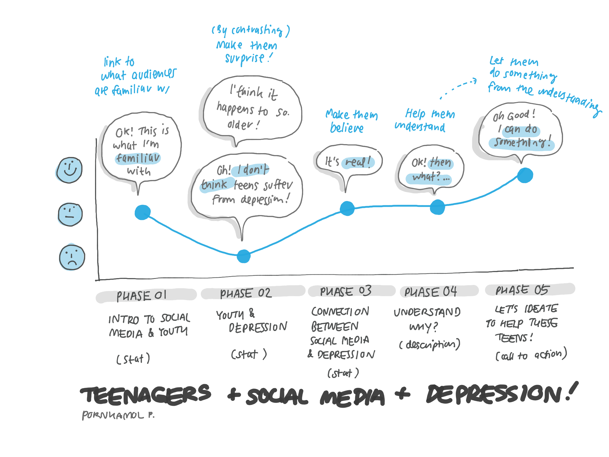

# Final Project (Part 1)
09 Febuary 2020
 
[Back to main page](/README.md)

# 1. The project brief

Despite social media are believed to help connecting people together, it can also be a cause in loneliness and depression in teenagers.

# 2. Structure

There will be 5 main phases in my final project.  The first phase will give an introduction about general information of the social media such as the growing number of people using social media in different platform in all age groups.  Then it will show that teenagers contribute the highest numbers in using those platform. (using data source 1.). This helps engaging users with easy and familiar content before digging deeper into the detail of next phases.  At this stage, audiences might feel positive and normal.

In the second phase, I would like to surprise audiences by contrasting the growing number of teens getting connected through social media to the high number of the same group suffering from loneliness or depression.  I design to make this part interactive.  The audience might be given the chart with number but with out the label of the age group and then let them guess.  Afterward, they might be surprised by how high in the numbers of teens with loneliness is. (using data source 2 and 3).

Phase 3 will zoom closer to the relationship between social network and depression.  I will use two set of information and compare them.  I will point out that, in the same period, while the social media in teenagers is increasing, the average level of loneliness also increases. (using data source 1 and 2).  This phase is designed to justify the argument and make audience into the topic.

After the audiences agree with the argument, I will discuss about the basic number and reasons why social media connects with depression or loneliness.  The objective of the phase is to help audience understand more of the problem and be prepared to take action in the next step with a grounded knowledge.

Lastly, I will invite audience to use their empathy in the problem (after noticing the statistic I provided) with the understanding in what might be the reasons of the problems to ideate possible solution we can help with this issue.  I will provide a link to a share brainstorm platform like Miro or google doc to provide space for ideation.

# 3. Initial Sketch

# 4. Data Source

I will use 3 main data sources all over the project page as mentioned in the content structure.  
In data source 1 (The rise of social media), the data that I will use is the number of people using media platform as shown in the first chart in the site.  I will use this to illustrate the general growth in social media.  Then I will use the data about the use of social media by age group to depict the popularity of social media among teenagers.

Data source 2 (Is there a loneliness epidemic?) and Data source 3 (Depression among Gen Z is skyrocketing) provide me the comparison of frequency of loneliness in England in different age group and depression rates by ages in the us.  I will use this 2 set of data in the phase 2 where I will let the audience guess which age group have highest tendency to suffer from depression.

Lastly, with the data in source 1 and source 2, I can create another data visualisation to compare the growth in social media and the growth in depression from time to time.

