# Final Project (Part 2)
16 Febuary 2020
 
[Back to main page](/README.md)

# 1. Wireframe and storyboard

From the rough sketch in the last part, I developed the wireframe using Balsamiq and labeled different charts that will be included in the content. The charts are mocked up separately using Tableau.

## 1.1 Screen Wireframe

In the phase1 after the heading and the background photo, I begin the story with the critical statistic of how much people use social media, in general, today and give some description about the growing trends of social media. Afterward, I provide detail about how the exact pattern looks like and the increasing number of the social network used in deferent platforms in chart 1. In chart 2, I scoped down the story and focused on the youth by illustrating that youth contributes the highest number for social media users.

For phase 2, I sacrificed one screen for a prompt to invite audiences’ engagement to guess about the details of the next chart. I illustrated with choices of what might be the topic of this chart three, and the answer will be given in chart 4. Lastly, the chart about the relationship between social network and depression trends in teenagers are provided in diagram 5.

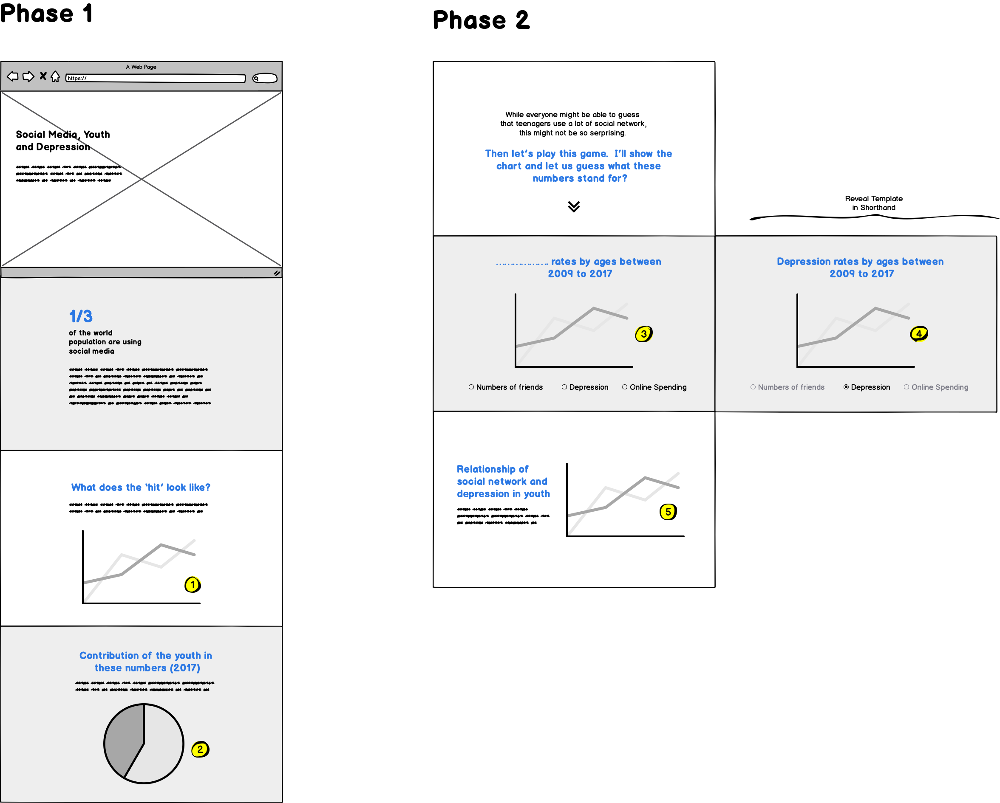

In phase 3, the fact behind the topic will be provided, such as why the social network can be a cause of depression in teenagers or the specific example on a type of social network which could be more harmful than others. In this section, it will be more descriptive with some photos. Only some statistical numbers will be called out to grab attention.

Lastly, in the last phase, some conclusions will be provided with a button to call an action.

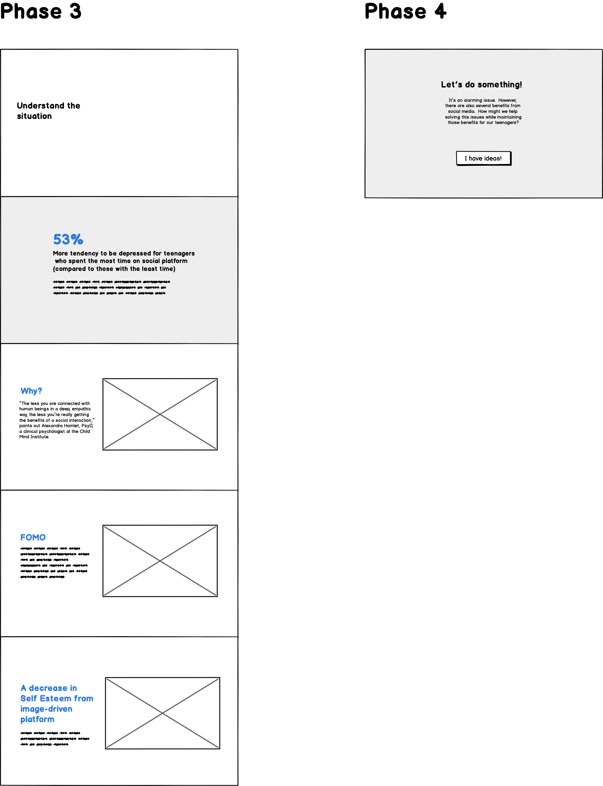

## 1.2 Chart wireframes

Charts are prepared from different data source to be ready to test with users in the next steps.  The example of the charts are provided in the later sections.
 
Chart 1: Number of people using social media worldwide 
Chart 2 : People who use at least one social media platform by age group 
Chart 3 : Depression rate in last 12 months by age groups 
Chart 4: Relationship between social media and depression in teenagers 
Chart 5: The uses of Instagram by age groups un the US (2019) 

# 2. User Research

After the wireframe is developed, I drafted an interview protocol and conducted user research on the overall storyboard and each chart mockup.

## 2.1 Target audience and participants

This project targets those without a background in statistics or data, so the tone of the story will be more narrative and easy to read for anyone. In terms of lifestyle, it targets anyone who uses social media as this can be related to anyone or their family members. It does not only help introduce them to the alarming issues which happen with teenagers, but it also helps them observe their behavior if they tend to experience depression from their social media usage.

There are 3 participants in this user research session. The first one is a woman with one adult daughter. She only uses social media moderately. The second one is a single working man who uses a lot of social media. The last one is a woman with 3 teenage children, and she also uses social media heavily.

## 2.2 Protocol

My method is to walk through the screen wireframe and show my participants a chart when it is relevant. Moreover, I always remind them to ask a question whenever they do not understand. The objective is to find out if the message I try to convey is clear and if easy for them to comprehend. What some of the obstructions which lead to their confusion are.  I try not to use too many questions but ask why after each answer to dig deeper in their understanding. These are the example of my research sequence and problems.

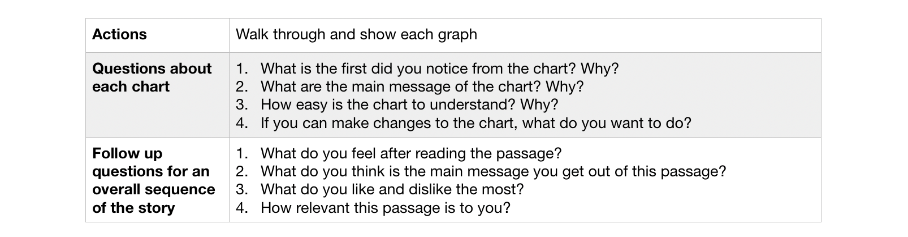

## 2.3 Overall Findings

“I kinda know that it can affect self-esteem because, to be honest, I sometimes feel that” - Participant 3

“This makes me feel even more worried about social media. However, it’s good to know more about it so I can be aware” - Participant 1

I have found several insights out of this research. One of them is that everyone has a sense that social media can negatively affect mental health but, before being shown this project, they have not expected that it can be this severe, especially for teenagers. However, one difference is that participant 1, who usually does not heavily use social media, feel more surprised about this fact because she does not know every feature in the platform.

# 3. Findings and Improvement

## 3.1 Structure

After the user testing, I summarised the main areas that are needed to be developed and marked in the wireframe as following.

  
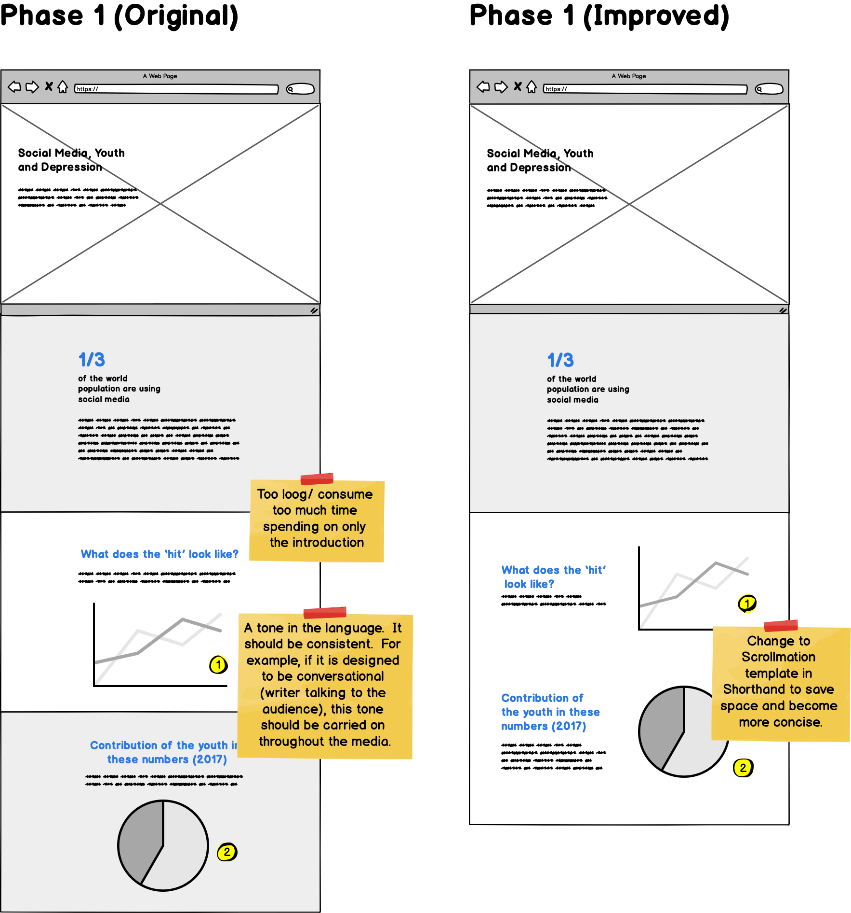
    
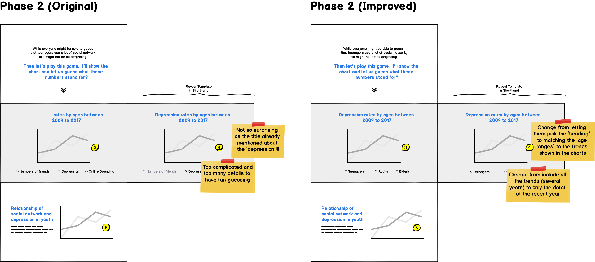
    
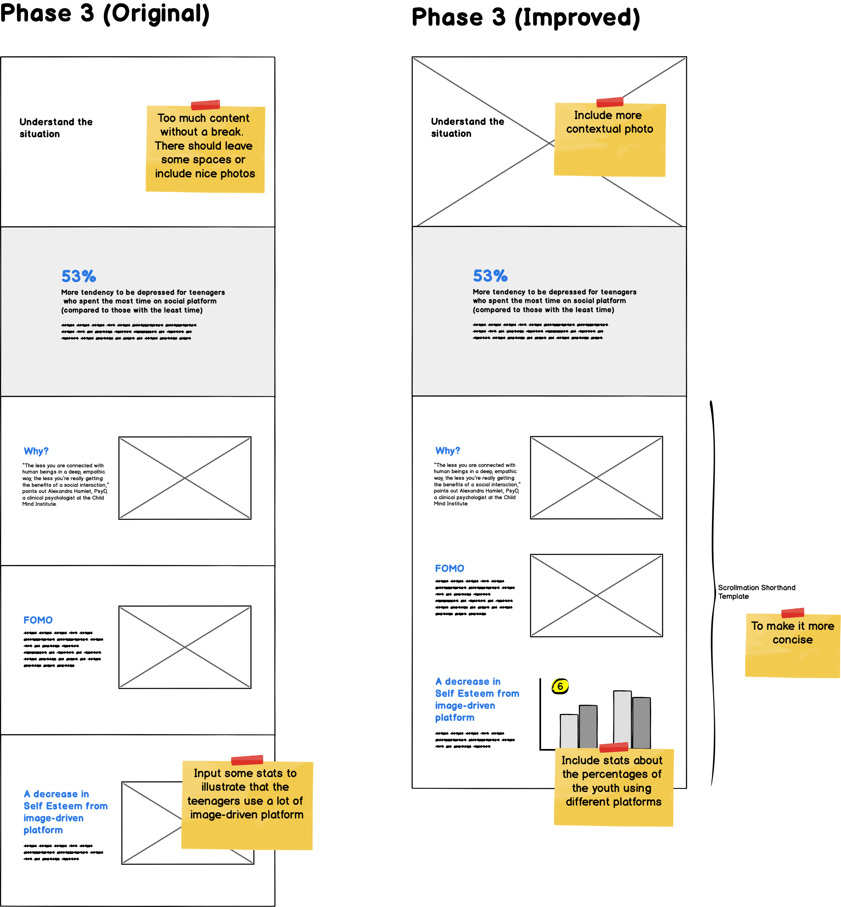
    

## 3.2 Chart 1: Number of people using social media worldwide

There is no line for the total number of all platforms in the original chart.  However, the participant mentioned that all it can tell is that the number of users on any social media platform is increasing, but it is not significant.  Moreover, the effect from social media to mental health can derive from all platform types, so it can be better to include one line to show the overall trend.  Therefore, I added that line in the improved version and found out that it can help to emphasize the growth, especially after 2012.

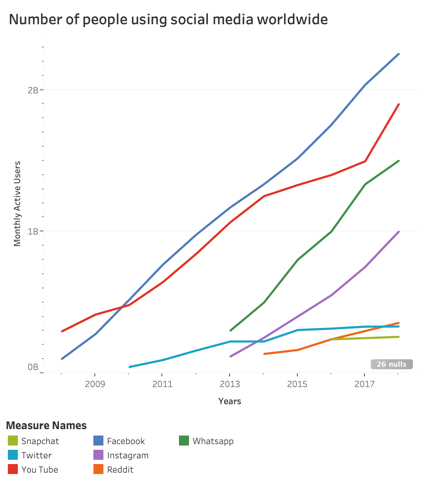
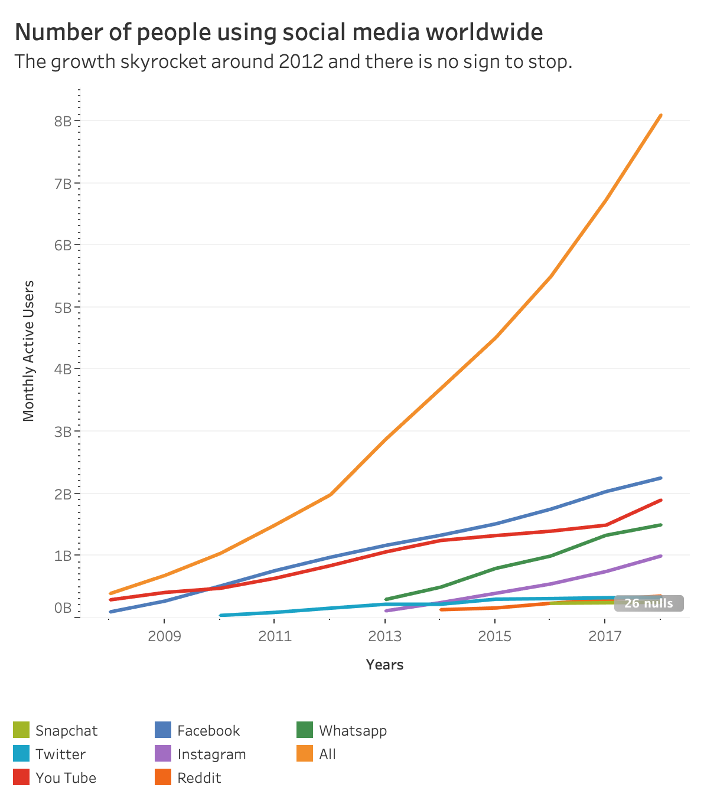

## 3.3 Chart 2: People who use at least one social media platform by age group

At first, I thought that there is no need for different colors to be used here, and I wished to make the chart as simple as possible. However, from the participant’s comment, highlighting the 18-29 age group will help him focus on what I want to convey, which is that teenagers are the group that uses the social platform the most.

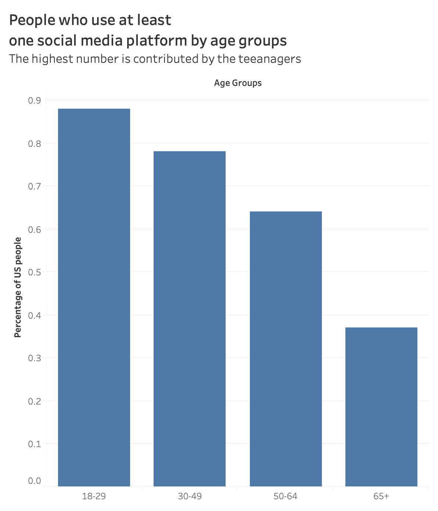
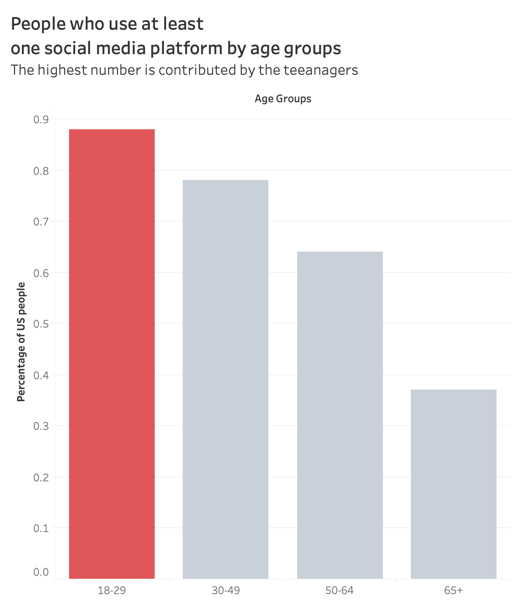

## 3.3 Chart 3: Depression rate in last 12 months by age groups

Initially, I left a gap in the heading of the chart to let the audience guess what the header is about.  The participants commented that this is not that surprising because the topic of the passage has already told them that is will be about depression.  Moreover, the line graph provided too much information that is not needed for introducing the relationship with depression.  For example, the changes throughout several years may not be essential and can be distracting.  Therefore, in the improved version, I change to let the audience match the age group with the bar chart (for only one year, 2017)

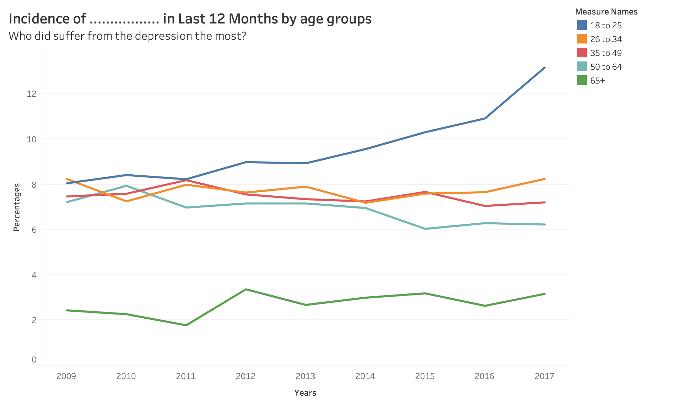
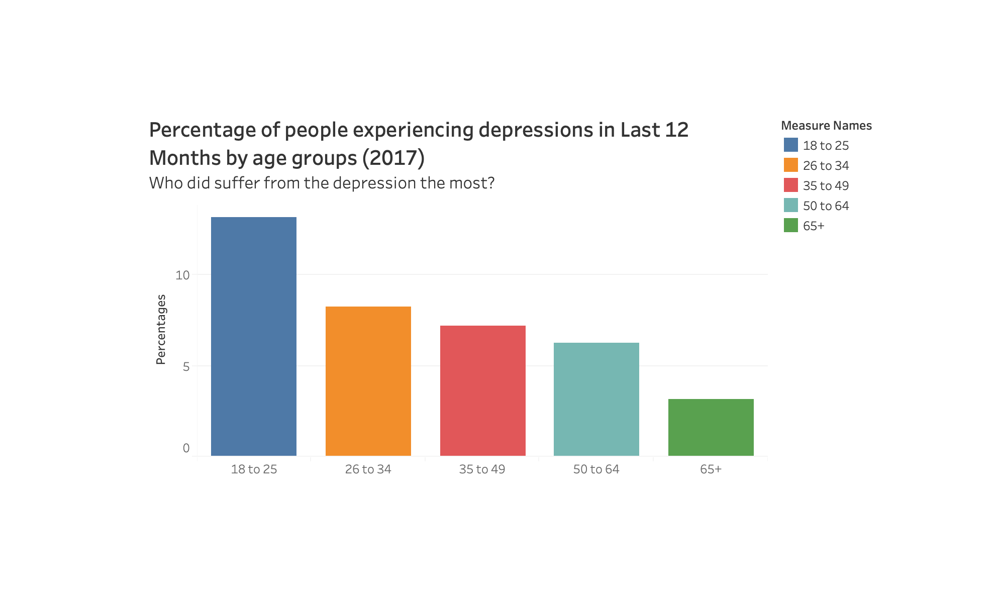
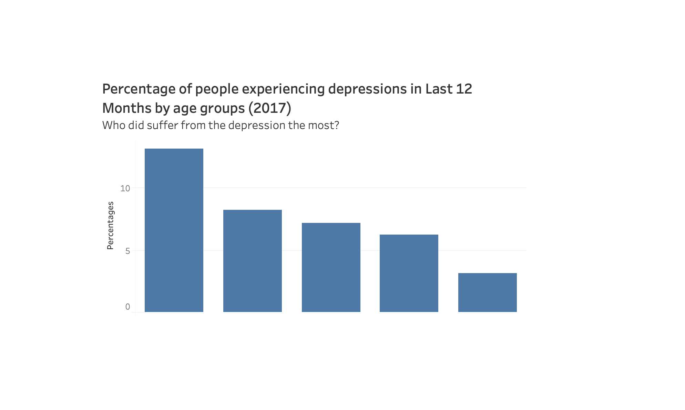

