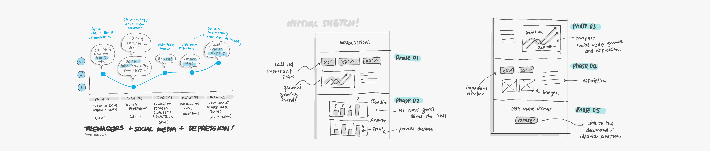
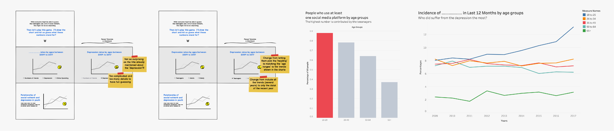

# Final Project (Part 3: Second Development)
26 Febuary 2020
 
[Back to main page](/README.md)

| Project Proposal | First Development | Second Development|  Final Design |
| ------------- | ------------- | ------------- | ------------- |
| [Part 1](/FinalPart1.md) | [Part 2](/FinalPart2.md)  | [Part 3](/FinalPart3.md) |  [Final](https://carnegiemellon.shorthandstories.com/socialmedia-youth-and-depression/index.html) |

# 1. The Process

The process of the project is separated into three main parts, and more details for each section are already provided in the table above.  "Although social media are believed to help to connect people, it can also be a cause of loneliness and depression in teenagers." is the brief I proposed and is the direction I used to craft the content throughout the project. 

In part 1, I explore the story arch or the overall structure of the data visualization, did research on the available dataset on my domain, and did initial sketches for my wireframe.

In the second part, all the rough sketches in the previous phase were recreated into a digital version.  The user testing was conducted using those digital mockups, and the design was improved utilizing the results of the user testing.

In this part, I moved on developing and finalizing the data visualization artifacts as well as the overall content on an online platform called Shorthand.

# 2. The Data Source

In the final data visualization, there are multiple data sources and information references about social networks and depression that I utilized in the project as follows.

1. Journal of Abnormal Psychology, Twenge et al. 
2. [https://childmind.org/article/is-social-media-use-causing-depression](https://childmind.org/article/is-social-media-use-causing-depression)  
3. [https://www.pewresearch.org/internet/fact-sheet/social-media](https://www.pewresearch.org/internet/fact-sheet/social-media)  
4. [https://www.businessinsider.com/depression-rates-by-age-young-people-2019-3](https://www.businessinsider.com/depression-rates-by-age-young-people-2019-3)  
5. [https://ourworldindata.org/loneliness-epidemic](https://ourworldindata.org/loneliness-epidemic)  
6. [https://ourworldindata.org/rise-of-social-media](https://ourworldindata.org/rise-of-social-media)  

# 3. The Target Audience

This project targets those without a background in statistics or data, so the tone of the story will be more narrative and easy to read for anyone. In terms of lifestyle, it targets social media users as this can be directly related to them or their family members. It does not only help introduce them to the alarming issues which happen with teenagers, but it also helps them observe their behaviors if they tend to experience depression from their social media usage.

In order to engage this group of audience, I try to simplify charts or graphs used by only emphasizing the related information.  I used descriptive languages and contextual icons (rather than only numbers and texts), so it is skimmable and easy to understand by anyone.  Moreover, infographic is used in some data visualization to make the context more interesting.

# 4. Finalizing the Project

The main thing that I have done after the last part (digital wireframe, user testing, and first development) is the graphical identity and consistency of all the visualization.  By using Tableau, the draft of the visualization is created; however, they were in different styles and not consistent.  This does not only affect the aesthetic of the overall passage but can hugely affect how users understand the content.  Therefore, I reviewed all graph and chart, design a guideline, and applied to all the artifacts.  For example, bright red is used to highlight or with a focused area.

Moreover, after fitting some of the visualizations to Shorthand's reveal image function, some infographic within the chart was adjusted to fit seamlessly with effect from Shorthand.

Lastly, from the comments I received, the last call to action part required too much effort from the audience, and there is less tendency that most of them will join.  Therefore, the call to action is changed from letting the audience brainstorm ideas to solve the problem to encouraging them to observe their own or their loved ones' behavior if they are negatively affected by the social media from some information provided by the external media.

# 5. Observations

After all, one important thing I learned is that telling stories with a support of data is like editing a movie.  It is not easy to make the story interesting, but there are several tools we can use, such as a story arc, etc.  However, to tie several pieces of data together in order to support an argument is so fragile because the author can easily manipulate it to tell various stories.  Therefore, creativity should also come with ethics while crafting a story with data.

# 6. Final

Take a look at the final piece at [https://carnegiemellon.shorthandstories.com/socialmedia-youth-and-depression/index.html](https://carnegiemellon.shorthandstories.com/socialmedia-youth-and-depression/index.html)

